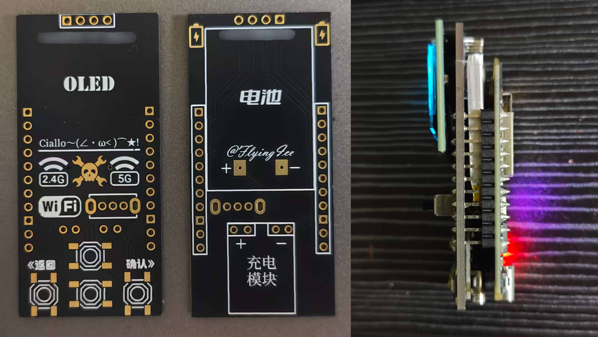
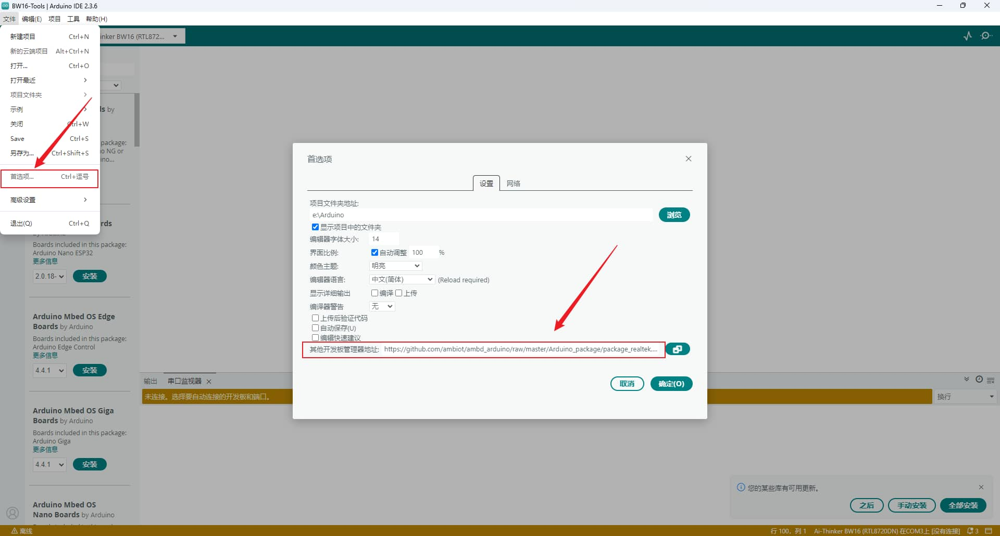
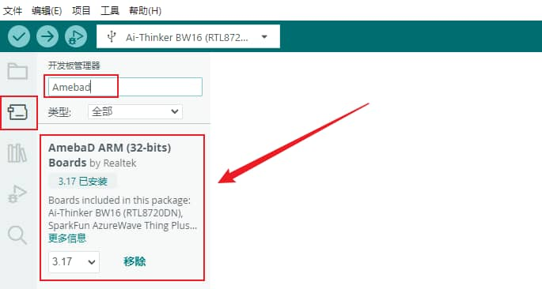
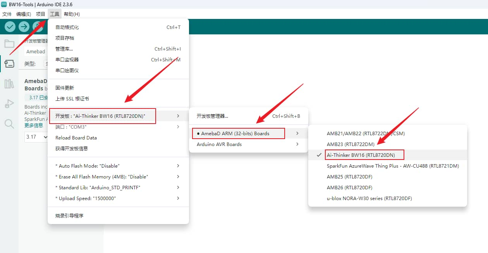
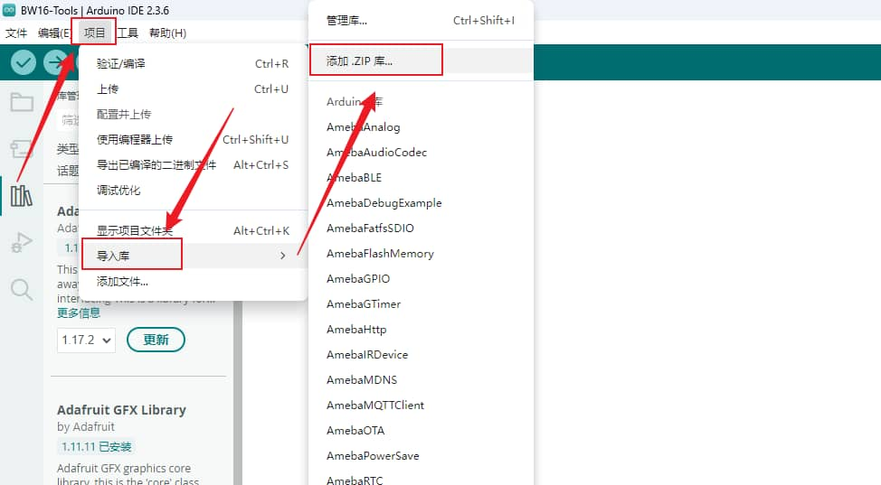
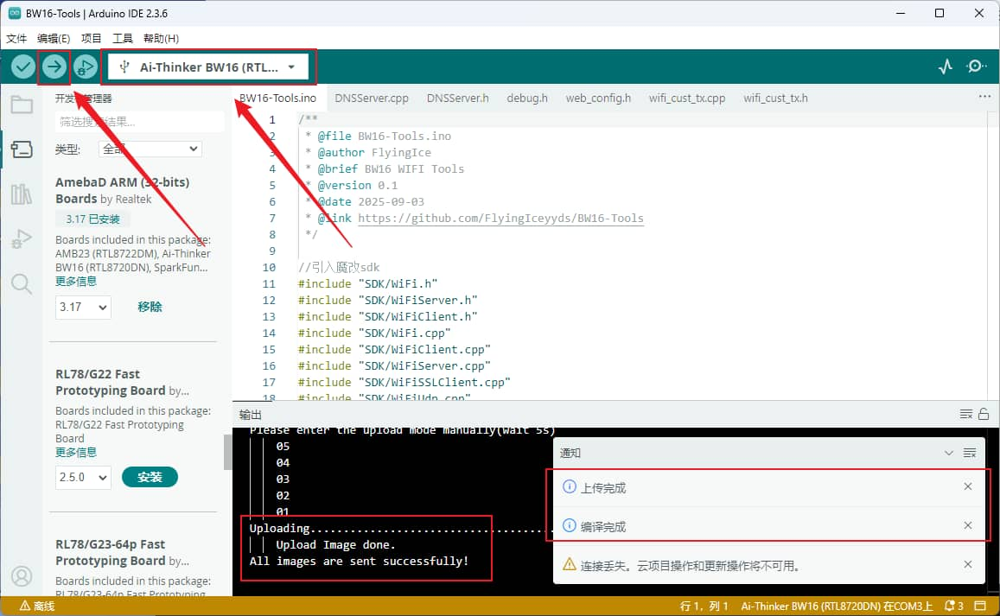

# [BW16-Tools](https://github.com/FlyingIceyyds/BW16-Tools)
基于Ai-Thinker BW16 RTL8720DN 的轻量级综合无线安全测试工具。包含解除身份认证（Deauth），信道干扰（Channel Interference），Deauth/Disassoc帧检测（Detect），密码钓鱼（Phishing），认证/关联帧洪水攻击（Dos）等。仅用于安全性研究和教育目的，请勿滥用。使用Arduino开发。

# 使用须知
本项目旨在合规前提下用于安全性研究和教育目的，请勿滥用。

- 严禁售卖
- 严禁任何商业用途

# 功能介绍
- 扫描SSID/AP [Scan]
    1. 快速扫描：常规主动+被动扫描
    2. 深度扫描：多种扫描模式，逐个信道扫描
- 解除认证攻击 [Attack -> Deauth]
    - 发送解除认证管理帧强制客户端断开连接
    - WPA3强制启用管理帧保护，所以对WPA3网络无效
- 信标帧攻击 [Attack -> Beacon]
    1. 随机信标帧攻击：发送大量随机信标帧
    2. 克隆指定AP：克隆指定AP发送的信标帧SSID
- 密码钓鱼 [Phishing]
    - 支持选择Web页面样式
- 连接/信道干扰 [Channel Interference]
    - 将目标AP发送的信标帧和探测响应克隆到多个信道
    - 客户端无法确认真正的AP工作在哪个信道，从而干扰连接
    - 通信层面干扰，无视WPA/WPA2/WPA3等安全协议
- AP洪水攻击 [Dos]
    - 向目标AP发送大量随机Mac地址的开放认证请求和关联请求帧
    - 实测针对轻量家用路由和随身WIFI效果显著，对于手机热点无效
- 攻击帧检测 [Detect]
    - 监听指定信道中的Deauth/Disassoc帧
    - 支持选择信道组（2.4G/5G/全部/常用）
    - 智能记录疑似被攻击的接入点
    - （然而并不智能，它会记录一些无用的内容）
- 监视器 [Monitor]
    - 监听指定信道中的数据包数量
    - 生成实时图表统计
    - 右上角出现“[*]”指示，表示监听到了解除认证/关联帧
- Web UI
    - 目前Web UI唯一功能：自定义SSID信标帧攻击
    - Web UI会占用更多资源，不考虑添加OLED菜单重复功能，无意义

# 部分代码来源
- https://github.com/shiyi226/5gwifi-bw16
    - 2025-06-11
- https://github.com/tesa-klebeband/RTL8720dn-WiFi-Packet-Injection
    - 2025-04-12
- https://github.com/A3ST1CODE/RTL8720DN-Captive
    - 2025-04-03
- https://github.com/wangergou2023/dog
    - 2024-07-15

# 许可证
采用 [GPL 3.0](https://www.gnu.org/licenses/gpl-3.0.html) 许可证，使用此项目，请遵守：
- 对于本项目及其衍生作品：
    - 禁止售卖
    - 禁止商业用途
- 对项目进行二次开发或使用相关代码
    - 强制开源并保持使用GPL3.0许可证
    - 禁止售卖
    - 禁止商业用途

# 使用指南

## 物料
- Ai-Thinker BW16-Kit (RTL8720DN)
- 0.96 OLED 屏幕 (SSD 1315 / 1306)
- 任意按钮 x 4
- 3.7v 锂电池 & 充电模块 & 电源开关（可选）

## 接线

| 0.96OLED | BW16-Kit |
| :-----: | :-----: |
| GND | GND |
| VCC | 3V3 |
| SCL | PA25 |
| SDA | PA26 |

| 按键映射 | BW16-Kit |
| :-----: | :-----: |
| BTN_UP (上) | PA27 |
| BTN_DOWN (下) | PA12 |
| BTN_OK (确认) | PA13 |
| BTN_BACK (返回) | PB2 |

按钮一端接BW16对应端口引脚（PA/PB），另一端接BW16任意GND引脚

可在 `BW6-Tools.ino` 中修改按键引脚定义：
``` cpp
// 按键引脚定义
#define BTN_DOWN PA12
#define BTN_UP PA27
#define BTN_OK PA13
#define BTN_BACK PB2
```

## PCB参考



### PCB

- [Gerber ZIP](./PCB/Gerber.zip)
- [嘉立创EDA JSON](./PCB/PCB-lceda.json)
    - 使用 [嘉立创EDA](https://lceda.cn/) 编辑

### BOM

- Ai-Thinker BW16-Kit [x1]
- 0.96 OLED (SSD 1315 / 1306) [x1]
- 4 * 4 * 1.8 轻触开关 [x4]
    - 长宽 4 * 4，高度随意
- SS12D07 G3 (8.8 * 4.5 * 3) 拨片开关 [x1]
    - 立式直插，长宽 8.8 * 4.5，柄长随意
- 3.7V 锂电池 502030 [x1]
    - 厚 5mm ,宽 20mm，长30mm
- CL4056 3.7V 锂电池充电模块 [x1]
    - 长16.8mm * 宽12mm

## 使用预编译bin烧录固件

前往 [Releases](https://github.com/FlyingIceyyds/BW16-Tools/releases) 下载编译好的bin文件，使用任意烧录工具烧录固件
- 烧录前需要按住BW16-Kit上的Burn按键不放，随后按一下RST按键进入下载模式

## 自行编译烧录固件

1.为Arduino IDE安装BW16开发板



- 文件 -> 首选项 -> 其他开发板管理器地址
- https://github.com/ambiot/ambd_arduino/raw/master/Arduino_package/package_realtek.com_amebad_index.json





2.导入本地库

- 依次导入本仓库 `libraries` 目录中所有库文件



3.编译项目并上传
- 打开`/src/BW16-Tools/BW16-Tools.ino`
- 使用USB连接BW16-Kit
- 按住BW16-Kit上的Burn按键不放，随后按一下RST按键进入下载模式
- 编译并上传

